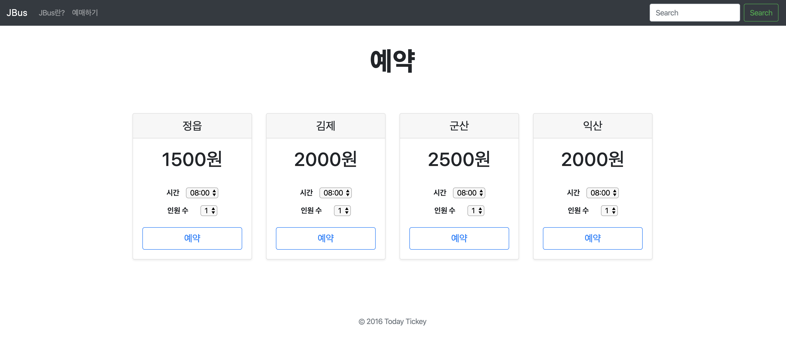
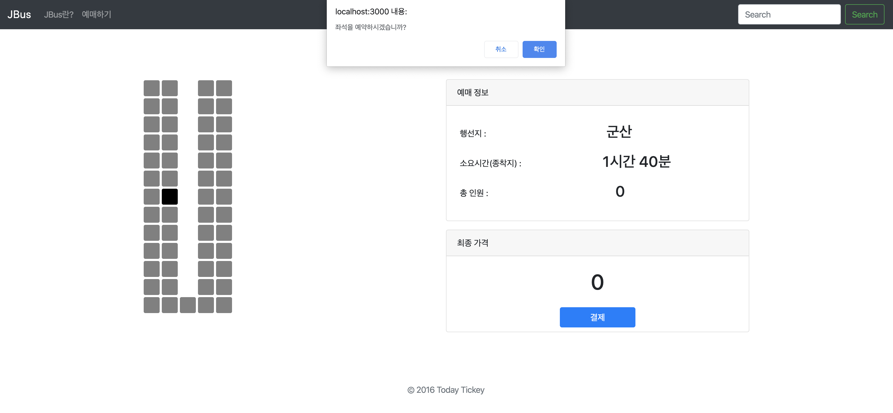

# 개요
* 프로젝트이름
    * TT (Today Ticket)  
     
* 프로젝트 수행 기간
    * 2016년 9월 ~ 2016년 12월  
     
* 기술 스택
    * Node.js
    * MongoDB  
     
* 프로젝트 내용
    * 교내버스 일일승차권 예매 시스템을 구현했습니다. 
    교내버스 일일 승차권을 예매하기위해선 무조건 현금으로만 결제를 해야헀고, 높은 곳에있는 총학생회실까지 걸어가야했습니다.
    이러한 상황을 웹을 이용하여 개선해보고자 프로젝트를 진행했습니다.
    **Node.JS와 Express Framework 를 이용해 서버를 구성하고, 데이터베이스로는 mongoDB**를 선택하여 구현하였습니다.  
      
* 기타
    

        
        
    

