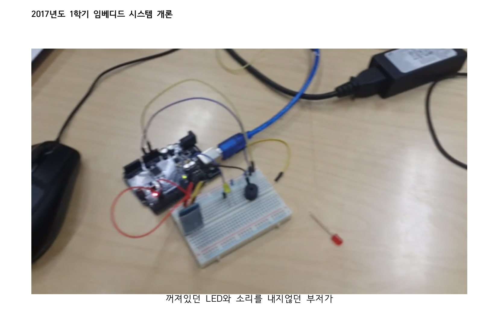
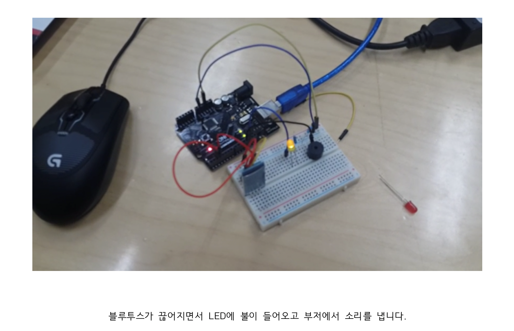

# 개요
* 프로젝트이름
    * 앗, 내 새끼!
     
* 프로젝트 수행 기간
    * 2017년 4월 ~ 2017년 6월  
     
* 기술 스택
    * Arduino
    * C
     
* 프로젝트 내용
    * 아두이노와 블루투스 모듈을 이용하여 미아방지디바이스를 만들어 보았습니다.
    디바이스와 스마트폰을 블루투스로 연결하고, 사이의 거리가 멀어지면 블루투스가 끊어지는 것을 이용했습니다.
    연결이 끊어지면 스마트폰으로 알림을 줌으로써, 빠른 대처가 가능하도록 하였습니다.  
      
* 기타
    

        
        
    
    
