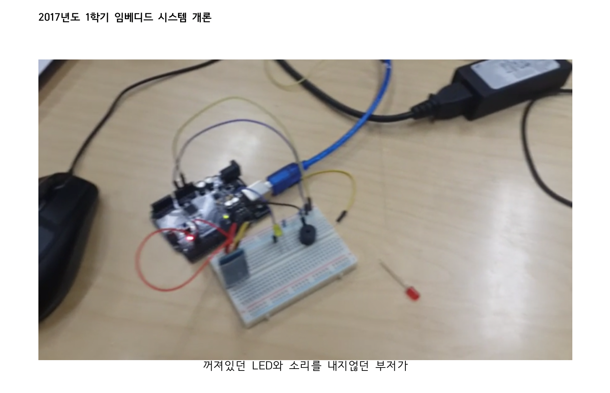
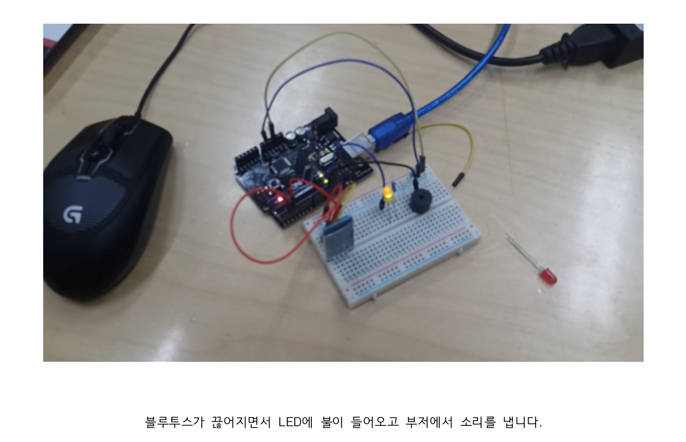

# 프로젝트 내용
* 프로젝트이름
    * AYST (Are You Stil There?)
     
* 프로젝트 수행 기간
    * 2017년 7월 ~ 2017년 12월  
     
* 기술 스택
    * Arduino
    * C
    * Node.js
     
* 프로젝트 내용
    * 공공화장실의 변기 사용가능 여부를 판단하고, 여부에따라 LED를 통해 이용자들에게 알려줍니다. 
    화장실 관리인의 해결이 필요한 경우(ex - 변기막힘) 별도의 알림 없이 자동으로 관리실에 알림을 가게하여, 
    즉각적인 대처가 가능하도록하는 서비스입니다. 
    **전 이 프로젝트에 참여하여, 냄새센서, 거리감지 센서, NodeMCU를 이용하여 변기 막힘 여부를 감지하고, 
    센서의 정보를 서버로 전송하여 웹화면에서 그래프로 보여주는 부분**을 개발했습니다.
      
* 기타
    

        
        
    
    
