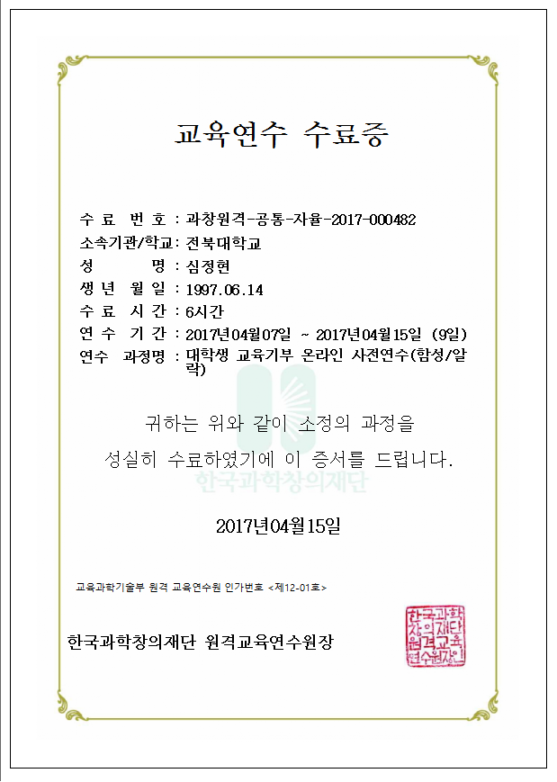

# 프로그램 내용
* 프로그램 이름
    * 코드클럽 대학생 교육기부
     
* 프로그램 수행 기간
    * 2017년 4월 ~ 2017년 6월  
     
* 기술 스택
    * 스크래치  
     
* 프로그램 내용
    * 3개월동안 전주의 중산초등학교에서 초등학생 4, 5, 6 학년들을 대상으로 스크래치 교육기부를 진행했습니다. 
    마지막 2주에는 학생들이 배운 내용들을 이용하여 게임을 만드는 수업을 진행하였고, 
    그 결과 “우주선 슈팅 게임”, “클릭하여 적을 없애는 게임” 등이 만들어졌습니다.  
      
* 기타
    

        
    
    
