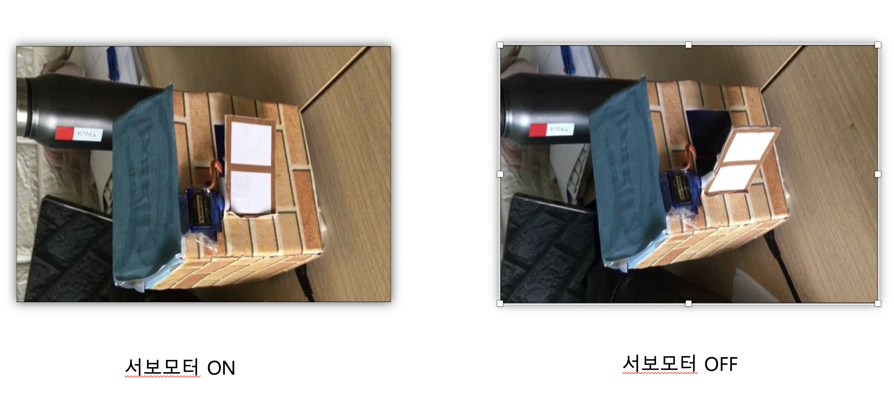

# 프로젝트 내용
* 프로젝트 이름
    * 스마트 홈  
     
* 프로젝트 수행 기간
    * 2018년 4월 ~ 2017년 6월  
     
* 기술 스택
    * Node.js
    * AWS
    * Linux              
     
* 프로젝트 내용
    * 라즈베리파이에 Node.js 서버를 올려, Node.js를 이용해 GPIO를 제어하는 방법을 공부했습니다. 
    AWS를 활용하여, 외부에 웹사이트를 공개하고, 
    웹사이트를 통해 집안 온/습도 모니터링, 창문 개폐, 전등 제어, 선풍기 제어를 구현하였습니다.  
      
* 기타
    

        
    
    
