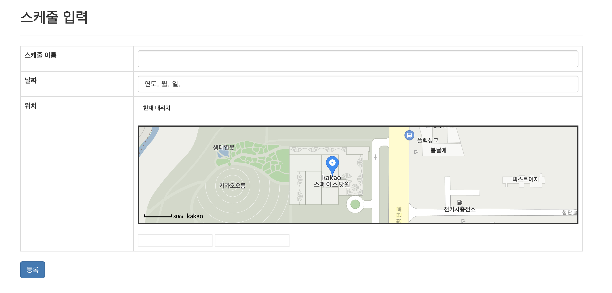
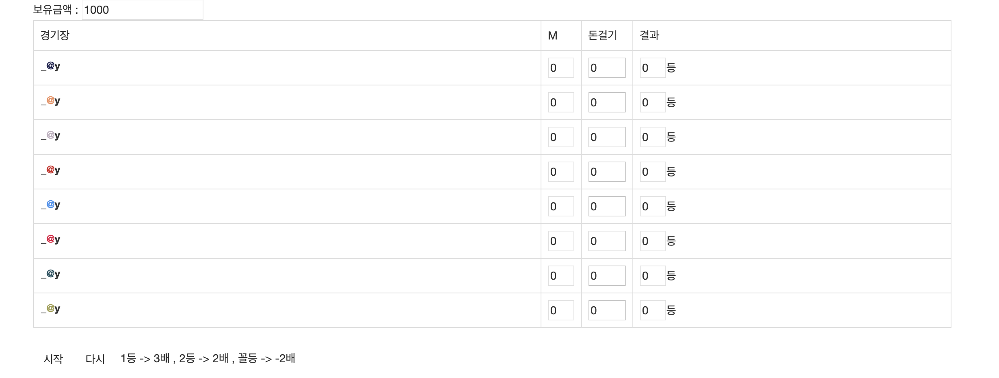

# 프로젝트 내용
* 프로젝트 이름
    * Schedular holic  
     
* 프로젝트 수행 기간
    * 2018년 11월 18일 ~ 2018년 11월 18일  
     
* 기술 스택
    * Node.js
    * MongoDB                
     
* 프로젝트 내용
    * 계획을 세우고 계획을 지킬시 소량의 마일리지로 보상을 주는 스케쥴러입니다. 
    카카오맵 API 를 이용하여, 계획 장소를 등록하고 지정된 시간에 해당 장소에 있을시 마일리지를 지급합니다. 
    플레이어는 마일리지를 이용해 간단한 미니게임을 할 수 있고, 미니게임을 통해 마일리지를 더 적립하거나 잃을 수 있습니다.  
      
* 기타   
    

          
         
        
    
  
