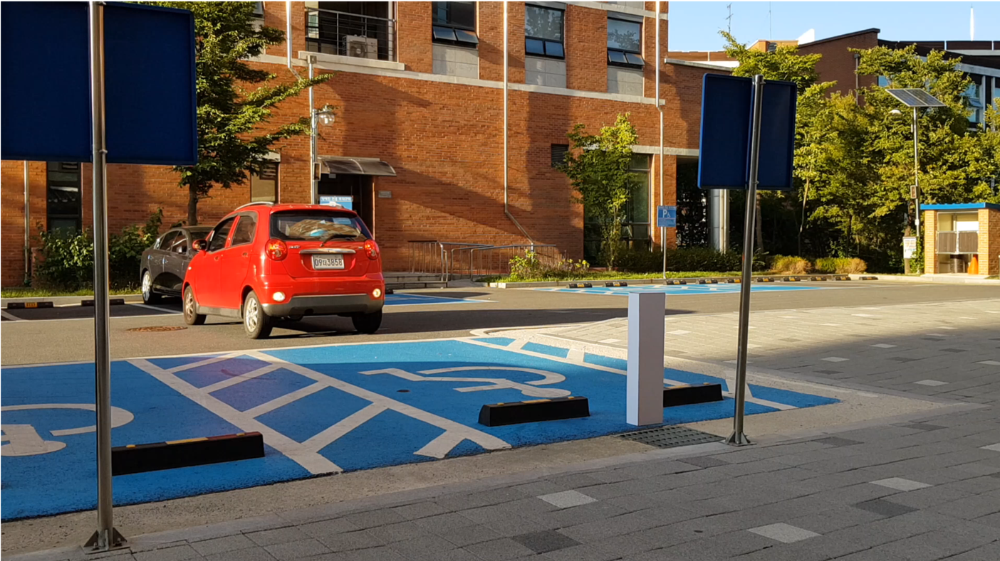
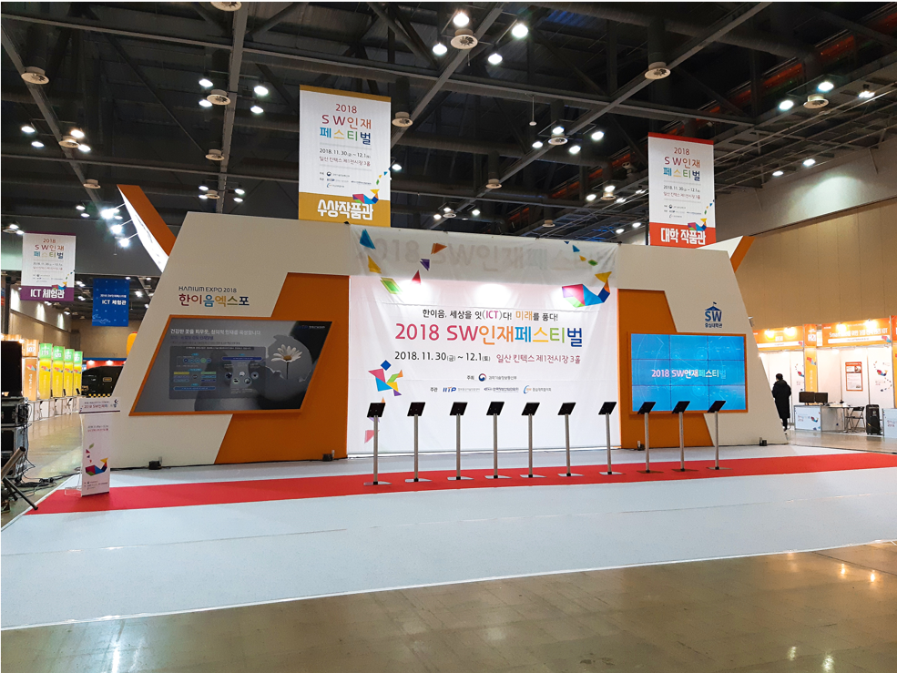

# 프로젝트 내용
* 프로젝트 이름
    * 씨잉(Seeing)   
     
* 프로젝트 수행 기간
    * 2018년 5월 ~ 2018년 12월  
     
* 기술 스택
    * Node.js
    * MongoDB                
    * OpenCV
    * OCR
    * Python                
     
* 프로젝트 내용
    * OpenCV를 이용해 자동차의 번호판을 분석한 후, 서버로 전송하여 장애인 등록여부를 확인합니다. 
    장애등록이 되어있지 않은 차량이라면 차주에게 경고문자를 주고, 
    5분후에도 조치가 이뤄지지 않았다면 행정안전부에 자동으로 민원신고를 합니다. 
    전 이 프로젝트에 참여하여, **라즈베리파이로 부터 데이터를 받는 서버, 임시 행정안전부 서버를 구현하고 운영하였습니다.
    또한, Tesseract OCR을 이용하여 자동차 번호판의 번호를 인식하는 것을 학습**시켰습니다.  
     
    영상 : https://www.youtube.com/watch?v=7wQER_xu_Vc  
      
* 기타
    

          
         
          
    
  

