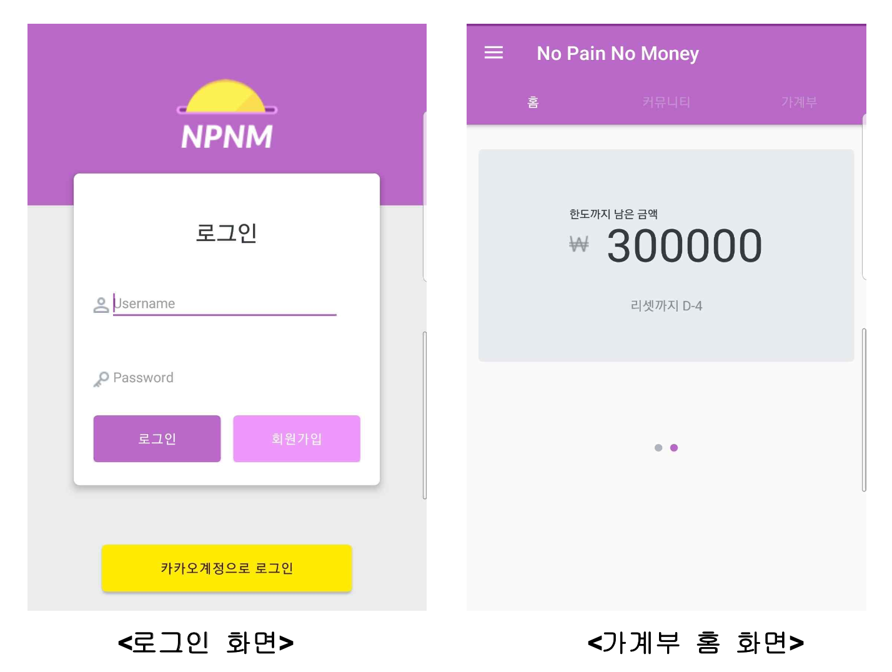
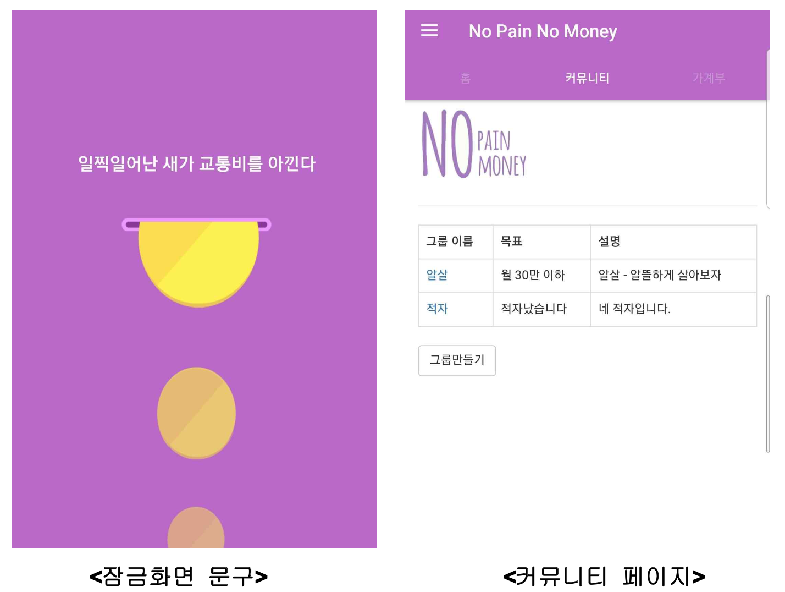

# 프로젝트 내용
* 프로젝트 이름
    * No Pain, No Money  
     
* 프로젝트 수행 기간
    * 2018년 5월 ~ 2018년 12월  
     
* 기술 스택
    * Java
    * MongoDB                
    * Node.js                
     
* 프로젝트 내용
    * 벌칙을 통해 과도한 소비를 막아주는 가계부입니다. 
    사용자가 소비 목표를 설정하고, 일정량 이상의 소비가 발생시 사용자에게 경각심을 일으켜줄만한 벌칙(홀드화면 변경, 알림창)을 줍니다. 
    추가로  서로의 소비계획을 공유할 수 있는 커뮤니티를 만들었습니다. 
    전 이 프로젝트에 참여하여 **카카오 로그인 API를 활용하여 로그인 기능을 구현하였고, 
    Socket.IO를 이용하여 실시간 대화형 커뮤니티를 구현했습니다. 
    또한 게시판형 커뮤니티를 제작하였으며, 앱 운영에 이용되는 데이터베이스를 설계하고 관리**하였습니다.  
      
* 기타   
    

          
         
          
    
  

