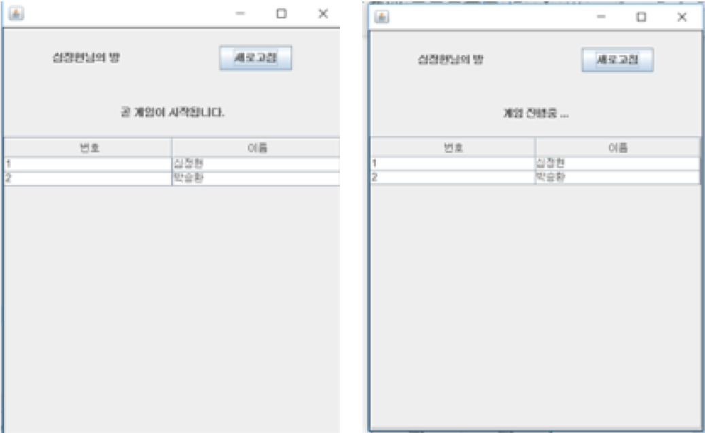

# 프로젝트 내용
* 프로젝트 이름
    * Schedular holic  
     
* 프로젝트 수행 기간
    * 2018년 11월 18일 ~ 2018년 11월 18일  
     
* 기술 스택
    * Java
    * MongoDB                
    * Socket                
     
* 프로젝트 내용
    * 학과 수업으로 들은 소스코드분석 과목에서 Java를 사용하여 네트워크 테트리스를 구현하였습니다. 
    하나의 서버를 열고 쓰레드를 이용하여 다수의 클라이언트를 받았습니다. 
    게임룸을 만들고 플레이어가 입장하여 플레이하는 방식으로 구현하였고, 게임 진행에 필요한 데이터들을 분석하여 패킷을 설계했습니다. 
    이후 JCloud라는 가상컴퓨팅서비스를 이용하여 서비스를 1달간 임시운영했습니다.  
      
* 기타   
    

          
         
          
         
          
         
          
    
  

