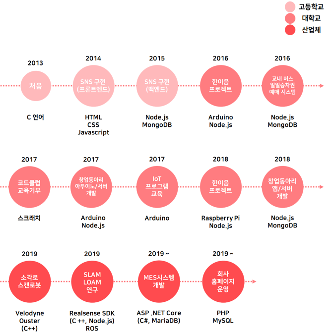

    

## 성장과정

 
## 기술 스택 / Tech Stack
* Language
    * C, C++, C#, Java, Javascript, HTML+CSS
* Server
    * Node.js - Express Framework
    * ASP .Net Core(C#) - MVC Framework
    * Java Socket
* Database
    * MySQL, MariaDB, MongoDB
* OS
    * Windowx, Ubuntu, macOS
* Etc
    * Arduino, Raspberry Pi, ARM Cortex M3

 

##학력
